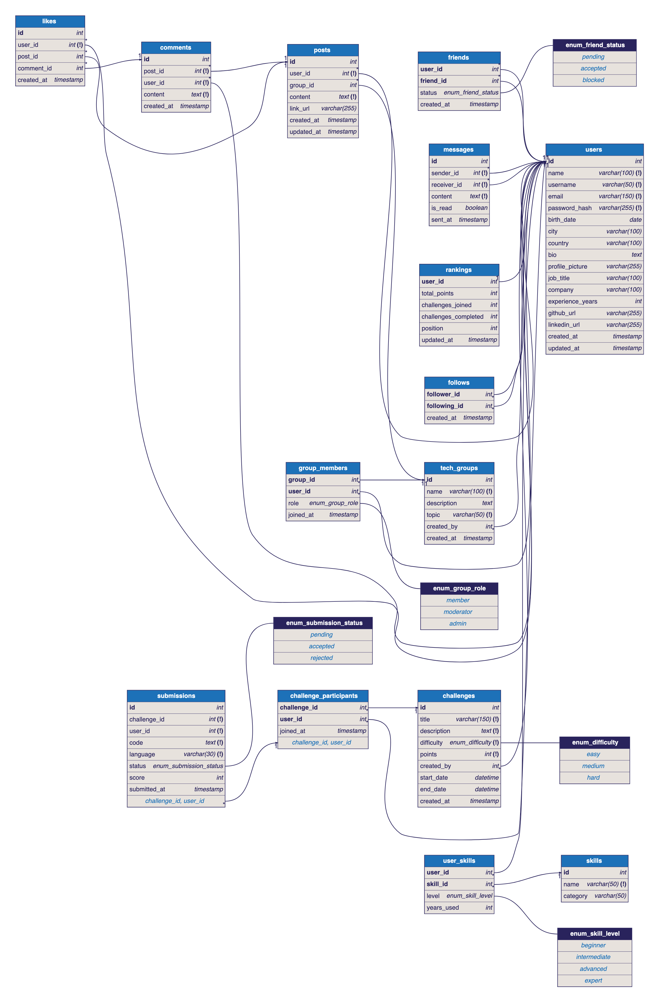

# 🗄️ Social Network DB

Modelagem do banco de dados de uma **rede social para programadores**, feita para a disciplina de **Laboratório de Programação** (Medida de Eficiência).

## 📌 Diagrama ER



> O código-fonte do diagrama está em [`docs/diagrama.dbml`](docs/diagrama.dbml). Para editar, é só colar no [dbdiagram.io](https://dbdiagram.io/d).

## 📁 Estrutura do repositório

```
social-network-db/
├── README.md
├── docs/
│   ├── diagrama.png     # Diagrama ER exportado
│   └── diagrama.dbml    # Código do diagrama (dbdiagram.io)
└── sql/
    └── social_network.sql   # Script de criação do banco + dados de exemplo
```

## 🧱 Tabelas

| Tabela | Descrição | Requisito |
|---|---|---|
| `users` | Usuários com dados pessoais (nome, e-mail, cidade, bio…) e profissionais (cargo, empresa, experiência, GitHub, LinkedIn) | 1 |
| `posts` | Postagens com texto (`content`) e link (`link_url`). Se `group_id` estiver preenchido, o post pertence a um grupo | 2, 8 |
| `comments` | Comentários nas postagens | 3 |
| `likes` | Curtidas em posts **ou** comentários (um `CHECK` garante que só um dos dois é preenchido) | 3 |
| `friends` | Conexões de amizade entre usuários (`pending`, `accepted`, `blocked`) | — |
| `follows` | Quem segue quem, para acompanhar postagens | 5 |
| `messages` | Mensagens privadas entre usuários | 4 |
| `skills` | Catálogo de habilidades de programação | 6 |
| `user_skills` | Habilidades de cada usuário, com nível e anos de uso | 6 |
| `tech_groups` | Grupos temáticos sobre linguagens/tecnologias | 7 |
| `group_members` | Membros de cada grupo e seu papel (`member`, `moderator`, `admin`) | 7 |
| `challenges` | Desafios de programação (dificuldade e pontuação) | 9 |
| `challenge_participants` | Usuários inscritos em cada desafio | 9 |
| `submissions` | Soluções enviadas (só quem participa do desafio pode enviar) | 9 |
| `rankings` | Ranking com pontos, desafios concluídos e posição | 10 |

O ranking é recalculado pela procedure `refresh_rankings()`, que soma os pontos de cada desafio distinto resolvido (submissão `accepted`) e define a posição com `RANK()`.

## ▶️ Como executar

Requisitos: **MySQL 8.0+**

```bash
mysql -u root -p < sql/social_network.sql
```

O script apaga e recria o banco `social_network`, cria as tabelas, índices, a procedure de ranking e insere dados de exemplo.

### Consultas de exemplo

```sql
USE social_network;

-- Ranking geral
SELECT r.position, u.username, r.total_points, r.challenges_completed
FROM rankings r
JOIN users u ON u.id = r.user_id
ORDER BY r.position;

-- Feed: posts de quem o usuário 4 segue
SELECT u.username, p.content, p.link_url, p.created_at
FROM posts p
JOIN follows f ON f.following_id = p.user_id
JOIN users u   ON u.id = p.user_id
WHERE f.follower_id = 4
ORDER BY p.created_at DESC;

-- Posts de um grupo
SELECT g.name AS grupo, u.username, p.content
FROM posts p
JOIN tech_groups g ON g.id = p.group_id
JOIN users u       ON u.id = p.user_id
WHERE g.name = 'Pythonistas BR';
```

## 🛠️ Ferramentas

- [dbdiagram.io](https://dbdiagram.io/) — modelagem do diagrama ER
- MySQL 8 — banco de dados
